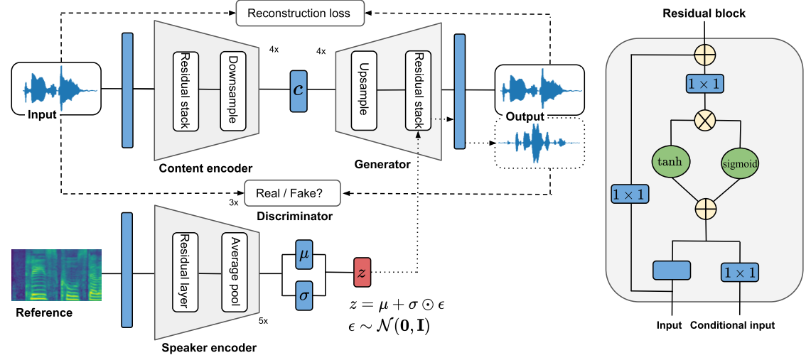

## Abstract

 
Voice conversion has recently gained increasing popularity in many applications of speech synthesis. The idea is to change the speaker identity from one into another while keeping other linguistic components unchanged. Many voice conversion approaches rely on the use of a vocoder for speech synthesis, and as a consequence, the speech quality heavily depends on such a vocoder. In this paper, we propose NVC-Net, an end-to-end adversarial network, which performs voice conversion from the raw audio waveform of arbitrary length. By disentangling the representation of the speaker identity from the content, NVC-Net is able to perform not only nonparallel traditional many-to-many voice conversion, but also zero-shot voice conversion from a short utterance of an unseen target speaker. More importantly, NVC-Net is non-autoregressive and fully convolutional, allowing fast inference. Our model is capable of producing samples at a rate of more than 3600 kHz on an NVIDIA V100 GPU, being orders of magnitude faster than state-of-the art methods under the same hardware configurations. Objective and subjective evaluations on nonparallel many-to-many voice conversion tasks show that NVC-Net obtains competitive results with significantly fewer parameters.

## Samples

Audio samples are taken from the VCTK data set [1].

### A. Traditional voice conversion
<table style='width: 100%;'>
	<thead>
	  <tr>
	    <th></th>
	    <th>Source</th>
	    <th>Target</th>
	    <th>NVC-Net&dagger;</th>
	    <th>NVC-Net</th>
	  </tr>
	</thead>

	<tbody>
	  <tr>
	    <th scope="row">M2M</th>
	    <td>
	      <audio controls="" >
		<source src="resources/audio/M2M_source.wav" type="audio/wav">
		Your browser does not support the audio element.
	      </audio>
	    </td>
	    <td>
	      <audio controls="" >
		<source src="resources/audio/M2M_target.wav" type="audio/wav">
		Your browser does not support the audio element.
	      </audio>
	    </td>
	    <td>
	      <audio controls="" >
		<source src="resources/audio/M2M_nvcneto.wav" type="audio/wav">
		Your browser does not support the audio element.
	      </audio>
	    </td>
	    <td>
	      <audio controls="" >
		<source src="resources/audio/M2M_nvcnet.wav" type="audio/wav">
		Your browser does not support the audio element.
	      </audio>
	    </td>
	  </tr>

	<tr>
	    <th scope="row">M2F</th>
	    <td>
	      <audio controls="" >
		<source src="resources/audio/M2F_source.wav" type="audio/wav">
		Your browser does not support the audio element.
	      </audio>
	    </td>
	    <td>
	      <audio controls="" >
		<source src="resources/audio/M2F_target.wav" type="audio/wav">
		Your browser does not support the audio element.
	      </audio>
	    </td>
	    <td>
	      <audio controls="" >
		<source src="resources/audio/M2F_nvcneto.wav" type="audio/wav">
		Your browser does not support the audio element.
	      </audio>
	    </td>
	    <td>
	      <audio controls="" >
		<source src="resources/audio/M2F_nvcnet.wav" type="audio/wav">
		Your browser does not support the audio element.
	      </audio>
	    </td>
	  </tr>

	
	
	<tr>
	    <th scope="row">F2M</th>
	    <td>
	      <audio controls="" >
		<source src="resources/audio/F2M_source.wav" type="audio/wav">
		Your browser does not support the audio element.
	      </audio>
	    </td>
	    <td>
	      <audio controls="" >
		<source src="resources/audio/F2M_target.wav" type="audio/wav">
		Your browser does not support the audio element.
	      </audio>
	    </td>
	    <td>
	      <audio controls="" >
		<source src="resources/audio/F2M_nvcneto.wav" type="audio/wav">
		Your browser does not support the audio element.
	      </audio>
	    </td>
	    <td>
	      <audio controls="" >
		<source src="resources/audio/F2M_nvcnet.wav" type="audio/wav">
		Your browser does not support the audio element.
	      </audio>
	    </td>
	  </tr>
	
	<tr>
	    <th scope="row">F2F</th>
	    <td>
	      <audio controls="" >
		<source src="resources/audio/F2F_source.wav" type="audio/wav">
		Your browser does not support the audio element.
	      </audio>
	    </td>
	    <td>
	      <audio controls="" >
		<source src="resources/audio/F2F_target.wav" type="audio/wav">
		Your browser does not support the audio element.
	      </audio>
	    </td>
	    <td>
	      <audio controls=""  >
		<source src="resources/audio/F2F_nvcneto.wav" type="audio/wav">
		Your browser does not support the audio element.
	      </audio>
	    </td>
	    <td>
	      <audio controls=""  >
		<source src="resources/audio/F2F_nvcnet.wav" type="audio/wav">
		Your browser does not support the audio element.
	      </audio>
	    </td>
	  </tr>
   </tbody>

</table>

**M2M**: Male to male; **M2F**: Male to Female; **F2M**: Female to male; **F2F**: Female to female 

### B. Zero-shot voice conversion

<table style='width: 100%;'>
	<thead>
	  <tr>
	    <th></th>
	    <th>Source</th>
	    <th>Target</th>
	    <th>NVC-Net</th>
	  </tr>
	</thead>

	<tbody>
	  <tr>
	    <th scope="row">S2U</th>
	    <td>
	      <audio controls="" >
		<source src="resources/audio/S2U_source.wav" type="audio/wav">
		Your browser does not support the audio element.
	      </audio>
	    </td>
	    <td>
	      <audio controls="" >
		<source src="resources/audio/S2U_target.wav" type="audio/wav">
		Your browser does not support the audio element.
	      </audio>
	    </td>
	    <td>
	      <audio controls="" >
		<source src="resources/audio/S2U_nvcnet.wav" type="audio/wav">
		Your browser does not support the audio element.
	      </audio>
	    </td>
	  </tr>

	<tr>
	    <th scope="row">U2S</th>
	    <td>
	      <audio controls="" >
		<source src="resources/audio/U2S_source.wav" type="audio/wav">
		Your browser does not support the audio element.
	      </audio>
	    </td>
	    <td>
	      <audio controls="" >
		<source src="resources/audio/U2S_target.wav" type="audio/wav">
		Your browser does not support the audio element.
	      </audio>
	    </td>
	    <td>
	      <audio controls="" >
		<source src="resources/audio/U2S_nvcnet.wav" type="audio/wav">
		Your browser does not support the audio element.
	      </audio>
	    </td>
	  </tr>
	<tr>
	    <th scope="row">U2U</th>
	    <td>
	      <audio controls="" >
		<source src="resources/audio/U2U_source.wav" type="audio/wav">
		Your browser does not support the audio element.
	      </audio>
	    </td>
	    <td>
	      <audio controls="" >
		<source src="resources/audio/U2U_target.wav" type="audio/wav">
		Your browser does not support the audio element.
	      </audio>
	    </td>
	    <td>
	      <audio controls="" >
		<source src="resources/audio/U2U_nvcnet.wav" type="audio/wav">
		Your browser does not support the audio element.
	      </audio>
	    </td>
	  </tr>
    </tbody>
</table>

**S2U**: Seen to unseen; **U2S**: Unseen to seen; **U2U**: Unseen to seen 

### C. Diversity

#### Source
<audio controls="" >
 <source src="resources/audio/source.wav" type="audio/wav">
		Your browser does not support the audio element.
</audio>

#### Target
<audio controls="" >
 <source src="resources/audio/target.wav" type="audio/wav">
		Your browser does not support the audio element.
</audio>

#### Samples produced by NVC-Net
<table style='width: 100%;'>
	<tbody>
	  <tr>
	    <td>
	      <audio controls="" >
		<source src="resources/audio/sample_1.wav" type="audio/wav">
		Your browser does not support the audio element.
	      </audio>
	    </td>
	    <td>
	      <audio controls="" >
		<source src="resources/audio/sample_3.wav" type="audio/wav">
		Your browser does not support the audio element.
	      </audio>
	    </td>
	    <td>
	      <audio controls="" >
		<source src="resources/audio/sample_7.wav" type="audio/wav">
		Your browser does not support the audio element.
	      </audio>
	    </td>
	  </tr>
	</tbody>
</table>

### References
[1] [Veaux, Christophe; Yamagishi, Junichi; MacDonald, Kirsten. (2017). CSTR VCTK Corpus: English Multi-speaker Corpus for CSTR Voice Cloning Toolkit, [sound]. University of Edinburgh. The Centre for Speech Technology Research (CSTR). https://doi.org/10.7488/ds/1994](http://datashare.is.ed.ac.uk/handle/10283/2651)

