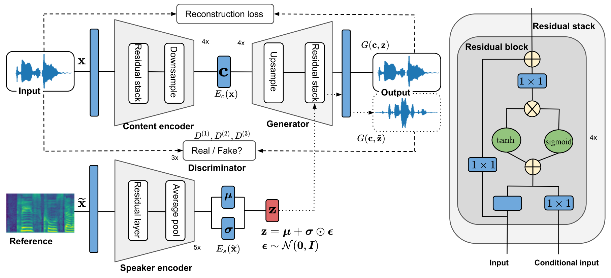

## **Abstract**

 
Voice conversion has gained increasing popularity in many applications of speech synthesis. The idea is to change the voice identity from one speaker into another while keeping the linguistic content unchanged. Many voice conversion approaches rely on the use of a vocoder to reconstruct the speech from acoustic features, and as a consequence, the speech quality heavily depends on such a vocoder. In this paper, we propose NVC-Net, an end-to-end adversarial network, which performs voice conversion directly on the raw audio waveform of arbitrary length. By disentangling the speaker identity from the speech content, NVC-Net is able to perform non-parallel traditional many-to-many voice conversion as well as zero-shot voice conversion from a short utterance of an unseen target speaker. Importantly, NVC-Net is non-autoregressive and fully convolutional, achieving fast inference. Our model is capable of producing samples at a rate of more than 3600 kHz on an NVIDIA V100 GPU, being orders of magnitude faster than state-of-the-art methods under the same hardware configurations. Objective and subjective evaluations on non-parallel many-to-many voice conversion tasks show that NVC-Net obtains competitive results with significantly fewer parameters.

##  **Samples** 

Audio samples are taken from the VCTK data set [1].

### **A. Traditional voice conversion**
Traditional many-to-many voice conversions are performed between different speakers that are seen during training. Some samples are presented in the table below.
<table style='width: 100%;'>
	<thead>
	  <tr>
	    <th></th>
	    <th>Source</th>
	    <th>Target</th>
	    <th>NVC-Net&dagger;</th>
	    <th>NVC-Net</th>
	  </tr>
	</thead>

	<tbody>
	  <tr>
	    <th scope="row">M2M</th>
	    <td>
	      <audio controls="" >
		<source src="resources/audio/M2M_source.wav" type="audio/wav">
		Your browser does not support the audio element.
	      </audio>
	    </td>
	    <td>
	      <audio controls="" >
		<source src="resources/audio/M2M_target.wav" type="audio/wav">
		Your browser does not support the audio element.
	      </audio>
	    </td>
	    <td>
	      <audio controls="" >
		<source src="resources/audio/M2M_nvcneto.wav" type="audio/wav">
		Your browser does not support the audio element.
	      </audio>
	    </td>
	    <td>
	      <audio controls="" >
		<source src="resources/audio/M2M_nvcnet.wav" type="audio/wav">
		Your browser does not support the audio element.
	      </audio>
	    </td>
	  </tr>

	<tr>
	    <th scope="row">M2F</th>
	    <td>
	      <audio controls="" >
		<source src="resources/audio/M2F_source.wav" type="audio/wav">
		Your browser does not support the audio element.
	      </audio>
	    </td>
	    <td>
	      <audio controls="" >
		<source src="resources/audio/M2F_target.wav" type="audio/wav">
		Your browser does not support the audio element.
	      </audio>
	    </td>
	    <td>
	      <audio controls="" >
		<source src="resources/audio/M2F_nvcneto.wav" type="audio/wav">
		Your browser does not support the audio element.
	      </audio>
	    </td>
	    <td>
	      <audio controls="" >
		<source src="resources/audio/M2F_nvcnet.wav" type="audio/wav">
		Your browser does not support the audio element.
	      </audio>
	    </td>
	  </tr>

	
	
	<tr>
	    <th scope="row">F2M</th>
	    <td>
	      <audio controls="" >
		<source src="resources/audio/F2M_source.wav" type="audio/wav">
		Your browser does not support the audio element.
	      </audio>
	    </td>
	    <td>
	      <audio controls="" >
		<source src="resources/audio/F2M_target.wav" type="audio/wav">
		Your browser does not support the audio element.
	      </audio>
	    </td>
	    <td>
	      <audio controls="" >
		<source src="resources/audio/F2M_nvcneto.wav" type="audio/wav">
		Your browser does not support the audio element.
	      </audio>
	    </td>
	    <td>
	      <audio controls="" >
		<source src="resources/audio/F2M_nvcnet.wav" type="audio/wav">
		Your browser does not support the audio element.
	      </audio>
	    </td>
	  </tr>
	
	<tr>
	    <th scope="row">F2F</th>
	    <td>
	      <audio controls="" >
		<source src="resources/audio/F2F_source.wav" type="audio/wav">
		Your browser does not support the audio element.
	      </audio>
	    </td>
	    <td>
	      <audio controls="" >
		<source src="resources/audio/F2F_target.wav" type="audio/wav">
		Your browser does not support the audio element.
	      </audio>
	    </td>
	    <td>
	      <audio controls=""  >
		<source src="resources/audio/F2F_nvcneto.wav" type="audio/wav">
		Your browser does not support the audio element.
	      </audio>
	    </td>
	    <td>
	      <audio controls=""  >
		<source src="resources/audio/F2F_nvcnet.wav" type="audio/wav">
		Your browser does not support the audio element.
	      </audio>
	    </td>
	  </tr>
   </tbody>

</table>

**M2M**: Male to male; **M2F**: Male to Female; **F2M**: Female to male; **F2F**: Female to female 

### **B. Zero-shot voice conversion**
Zero-shot many-to-many voice conversions are performed from/to speakers that are unseen during training. Some samples are presented in the table below.

<table style='width: 100%;'>
	<thead>
	  <tr>
	    <th></th>
	    <th>Source</th>
	    <th>Target</th>
	    <th>NVC-Net</th>
	  </tr>
	</thead>

	<tbody>
	  <tr>
	    <th scope="row">S2U</th>
	    <td>
	      <audio controls="" >
		<source src="resources/audio/S2U_source.wav" type="audio/wav">
		Your browser does not support the audio element.
	      </audio>
	    </td>
	    <td>
	      <audio controls="" >
		<source src="resources/audio/S2U_target.wav" type="audio/wav">
		Your browser does not support the audio element.
	      </audio>
	    </td>
	    <td>
	      <audio controls="" >
		<source src="resources/audio/S2U_nvcnet.wav" type="audio/wav">
		Your browser does not support the audio element.
	      </audio>
	    </td>
	  </tr>

	<tr>
	    <th scope="row">U2S</th>
	    <td>
	      <audio controls="" >
		<source src="resources/audio/U2S_source.wav" type="audio/wav">
		Your browser does not support the audio element.
	      </audio>
	    </td>
	    <td>
	      <audio controls="" >
		<source src="resources/audio/U2S_target.wav" type="audio/wav">
		Your browser does not support the audio element.
	      </audio>
	    </td>
	    <td>
	      <audio controls="" >
		<source src="resources/audio/U2S_nvcnet.wav" type="audio/wav">
		Your browser does not support the audio element.
	      </audio>
	    </td>
	  </tr>
	<tr>
	    <th scope="row">U2U</th>
	    <td>
	      <audio controls="" >
		<source src="resources/audio/U2U_source.wav" type="audio/wav">
		Your browser does not support the audio element.
	      </audio>
	    </td>
	    <td>
	      <audio controls="" >
		<source src="resources/audio/U2U_target.wav" type="audio/wav">
		Your browser does not support the audio element.
	      </audio>
	    </td>
	    <td>
	      <audio controls="" >
		<source src="resources/audio/U2U_nvcnet.wav" type="audio/wav">
		Your browser does not support the audio element.
	      </audio>
	    </td>
	  </tr>
    </tbody>
</table>

**S2U**: Seen to unseen; **U2S**: Unseen to seen; **U2U**: Unseen to seen 

### **C. Diversity**
NVC-Net can synthesize diverse samples by changing the latent representation of the speaker embedding. For a given reference utterance, the speaker network produces a Gaussian distribution. This allows us to sample multiple speaker embeddings. 

<table style='width: 100%;'>
	<thead>
	  <tr>
	    <th>Source</th>
	    <th>Target</th>
	  </tr>
	</thead>
	<tbody>
	  <tr>
	    <td>
	      <audio controls="" >
		<source src="resources/audio/source.wav" type="audio/wav">
		Your browser does not support the audio element.
	      </audio>
	    </td>
	    <td>
	      <audio controls="" >
		<source src="resources/audio/target.wav" type="audio/wav">
		Your browser does not support the audio element.
	      </audio>
	    </td>
	  </tr>
	</tbody>
</table>

<table style='width: 100%;'>
	<thead>
	  <tr>
	    <th colspan="3">Samples produced by NVC-Net</th>
	  </tr>
	</thead>
	<tbody>
	  <tr>
	    <td>
	      <audio controls="" >
		<source src="resources/audio/sample_1.wav" type="audio/wav">
		Your browser does not support the audio element.
	      </audio>
	    </td>
	    <td>
	      <audio controls="" >
		<source src="resources/audio/sample_3.wav" type="audio/wav">
		Your browser does not support the audio element.
	      </audio>
	    </td>
	    <td>
	      <audio controls="" >
		<source src="resources/audio/sample_7.wav" type="audio/wav">
		Your browser does not support the audio element.
	      </audio>
	    </td>
	  </tr>
	</tbody>
</table>

### **D. Additional studies**
Below are samples comparing the outputs between **NVC-Net wo** (without normalization on the content code) and **NVC-Net w** (with normalization on the content code).
<table style='width: 100%;'>
	<thead>
	  <tr>
	    <th>Source</th>
	    <th>Target</th>
	    <th>NVC-Net wo</th>
	    <th>NVC-Net w</th>
	  </tr>
	</thead>
	<tbody>
	  <tr>
	    <td>
	      <audio controls="" >
		<source src="resources/audio/sample_12_0-95_source.wav" type="audio/wav">
		Your browser does not support the audio element.
	      </audio>
	    </td>
	    <td>
	      <audio controls="" >
		<source src="resources/audio/sample_12_0-95_target.wav" type="audio/wav">
		Your browser does not support the audio element.
	      </audio>
	    </td>
	    <td>
	      <audio controls="" >
		<source src="resources/audio/sample_12_0-95_wo.wav" type="audio/wav">
		Your browser does not support the audio element.
	      </audio>
	    </td>	
	    <td>
	      <audio controls="" >
		<source src="resources/audio/sample_12_0-95_w.wav" type="audio/wav">
		Your browser does not support the audio element.
	      </audio>
	    </td>		  
	  </tr>
	 <tr>
	    <td>
	      <audio controls="" >
		<source src="resources/audio/sample_18_0-78_source.wav" type="audio/wav">
		Your browser does not support the audio element.
	      </audio>
	    </td>
	    <td>
	      <audio controls="" >
		<source src="resources/audio/sample_18_0-78_target.wav" type="audio/wav">
		Your browser does not support the audio element.
	      </audio>
	    </td>
	    <td>
	      <audio controls="" >
		<source src="resources/audio/sample_18_0-78_wo.wav" type="audio/wav">
		Your browser does not support the audio element.
	      </audio>
	    </td>	
	    <td>
	      <audio controls="" >
		<source src="resources/audio/sample_18_0-78_w.wav" type="audio/wav">
		Your browser does not support the audio element.
	      </audio>
	    </td>		  
	  </tr>		
	</tbody>
</table>

##  **References** 
[1] [Veaux, Christophe; Yamagishi, Junichi; MacDonald, Kirsten. (2017). CSTR VCTK Corpus: English Multi-speaker Corpus for CSTR Voice Cloning Toolkit, [sound]. University of Edinburgh. The Centre for Speech Technology Research (CSTR). https://doi.org/10.7488/ds/1994](http://datashare.is.ed.ac.uk/handle/10283/2651)

